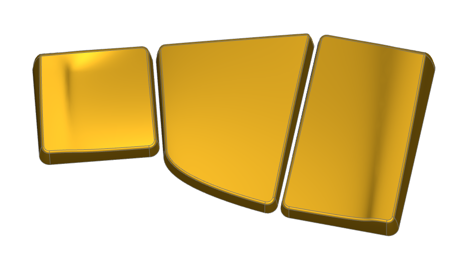
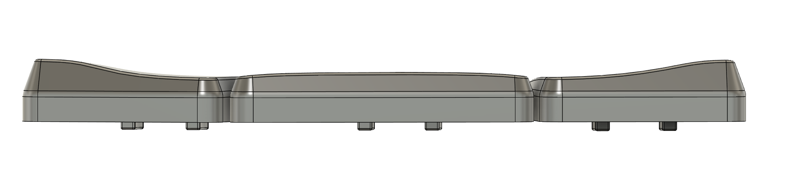

# Ripple Thumb Keycaps

This is a thumb cluster I designed originally for use with choc v1, but now has both choc and MX stems. The tucky key has choc sizing (18x17mm), the others have unique sizings.
The design has a "wavey" shape, which is most obvious when viewing from behind:

The exact topography of the cluster is difficult to see in images. 

## Motivation

There exist a number of keycap designs out there with a "columnar" or a "saddle" shape - KP Lame, Chicago Steno, OLS to name a few.
Said shape lends itself very well to four fingers of the hand, but it does not work for thumbs. Thumbs move in an arc rather than up and down.

This cluster was designed to provide a similar smooth and comfortable feeling to thumbs as one can obtain from CS. It is designed for the thumb to rest on the keys sideways. The upper corners of the inner and outer thumbs are warped so that the thumb is cupped slightly when moving away from the central point. The vertical midpoint of the keys is ever so slightly convex, which gives the thumb a nicer rest in the transition from knuckle to nail. This convex curvature bends across the surface of the middle keycap. The "wave" visible from the rear provides a similar effect to that of a "saddle".

## Design Guidelines

To maximise comfort and minimise thumb motion, custom spacing is needed for the thumb cluster. See e.g. Apiaster for how it is possible to design a keyboard with flexible support for both these keycaps and standard 1u caps.

 
The positions needed for the cluster are as follows:

Assume that the (x,y) centerpoint of the tucky 1u thumb's switch is at (0,0), where coordinate directions match that in KiCAD (-y points away from the user). Then:

- The (x,y) centerpoint of the middle unusually shaped key is at (19, 4), with a 10 degree rotation applied to it.
- The (x,y) centerpoint of the reachy key is at (37.5, 8), with a 16 degree rotation applied to it.

