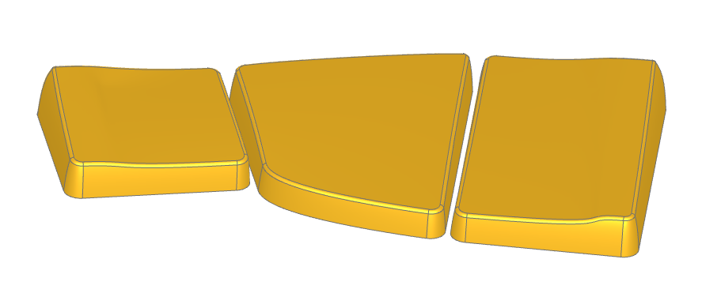
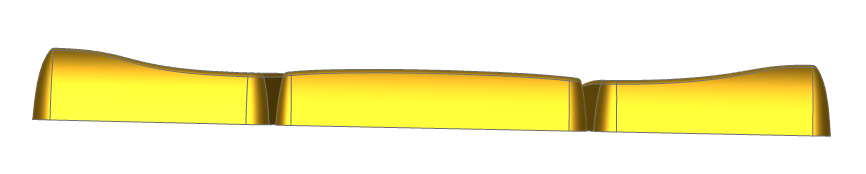

# Ripple Thumb Keycaps

This is a thumb cluster I designed for use with choc v1 keycaps, with choc spacing. It consists of:

- A tucky 18x17mm thumb
- An outer 18x29.75mm thumb
- An unusually shaped central thumb

The design has a "wavey" shape, which is most obvious when viewing from behind:

The exact topography of the cluster is difficult to see in images, and honestly also in person. You really need to feel it in order to appreciate it. It is designed for the thumb to rest on the keys sideways, no manuform style thumbs. The upper corners of the inner and outer thumbs are warped so that the thumb is cupped slightly when moving away from the central point. The vertical midpoint of the keys is ever so slightly convex, which gives the thumb a nicer rest in the transition from knuckle to nail. This convex curvature bends across the surface of the middle keycap. Likewise, the central keycap is convex horizontally as I found that to be more comfortable. 

A lower corner of the middle keycap is bent to prevent discomfort when only pressing the tucky thumb - for me, I can comfortably press the tucky thumb by only tucking the joint furthest from my wrist and not moving the other joint. Likewise, the outer thumb can be comfortably pressed by only moving the joint closer to my wrist. The upper corner of the central keycap is extended for aesthetic purposes, while a 1.75u vertical outer keycap was chosen to give the thumb plenty of space to rest on. The middle keycap is *just* wide enough that it works with multiple levels of curvature for the index fingers, but also narrow enough that overstretching of the thumb is less of a risk. (I would encourage you to primarily use the thumb side that you naturally rest on, and avoid using the other side too much). The gap between keys is narrow with no difference in topography aside from a narrow steep valley. The goal here was to simultaneously allow for comfortable thumb combos, but also use the valley to make it easy to feel the boundary between keys.

Finally, the spacing between the physical switches (which is *highly* unusual) is acceptable (though probably not ideal for most) for usage with three 1u keycaps (or two 1u keycaps and a single vertical 1.75u keycap, though where you'd find a vertical 1.75u keycap is beyond me).

If you wish to design a board around this thumb cluster, the spacing and rotations you'll need to provide to the keys is shown below:

